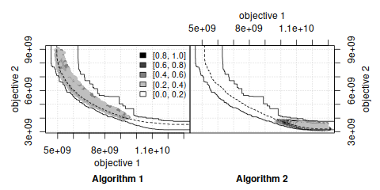
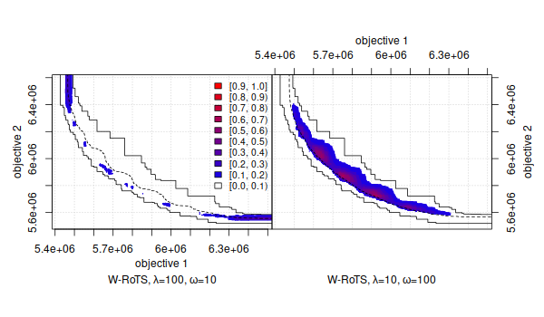

**mooplot**: Visualizations for Multi-Objective Optimization
============================================================

<!-- badges: start -->
[][r-mooplot-cran]
[][r-mooplot-cran-results]
[][r-mooplot-cran]
[![R build status][r-build-badge]][r-build-link]
[![Code Coverage][r-coverage-badge]][r-coverage-link]
[![r-universe version][r-universe-version-badge]](https://multi-objective.r-universe.dev/mooplot)
[![r-universe build status][r-universe-build-badge]](https://github.com/r-universe/multi-objective/actions/workflows/build.yml)
<!-- badges: end -->

[ [**Homepage**][r-mooplot-homepage] ]  [ [**GitHub**][r-mooplot-github] ]

**Maintainer:** [Manuel López-Ibáñez](https://lopez-ibanez.eu)

**Contributors:**
    [Manuel López-Ibáñez](https://lopez-ibanez.eu),
    [Carlos M. Fonseca](https://eden.dei.uc.pt/~cmfonsec/),
    [Luís Paquete](https://eden.dei.uc.pt/~paquete/),
    and Mickaël Binois.

---------------------------------------

Introduction
============

This webpage documents the `mooplot` R package. There is also a [`mooplot` Python package](https://multi-objective.github.io/mooplot/python/)

The **mooplot** package implements various visualizations that are useful in
multi-objective optimization. These visualizations include:

 * Visualization of Pareto frontiers.
 * Visualization of the Empirical Attainment Function (EAF) and the differences
between EAFs. The EAF describes the probabilistic distribution of the outcomes
obtained by a stochastic algorithm in the objective space.

These visualizations may be used for exploring the performance of stochastic local
search algorithms for multi-objective optimization problems and help in identifying
certain algorithmic behaviors in a graphical way.

The [book chapter](#LopPaqStu09emaa) [1] explains the use of these
visualization tools and illustrates them with examples arising from practice.

**Keywords**: empirical attainment function, summary attainment surfaces, EAF
differences, multi-objective optimization, graphical analysis, visualization.

**Relevant literature:**

 1. <a name="LopPaqStu09emaa"/>Manuel López-Ibáñez, Luís Paquete, and Thomas Stützle. [Exploratory Analysis of Stochastic Local Search Algorithms in Biobjective Optimization](https://doi.org/10.1007/978-3-642-02538-9_9). In T. Bartz-Beielstein, M. Chiarandini, L. Paquete, and M. Preuss, editors, *Experimental Methods for the Analysis of Optimization Algorithms*, pages 209–222. Springer, Berlin, Germany, 2010.<br>
    (This chapter is also available in a slightly extended form as Technical Report TR/IRIDIA/2009-015).<br>
    [ [bibtex](https://lopez-ibanez.eu/LopezIbanez_bib.html#LopPaqStu09emaa) |
    doi: [10.1007/978-3-642-02538-9_9](https://doi.org/10.1007/978-3-642-02538-9_9)
    | [Presentation](https://lopez-ibanez.eu/doc/gecco2010moworkshop.pdf) ]


Download and installation
-------------------------

The **mooplot** package is implemented in R. Therefore,
a basic knowledge of R is recommended to make use of all features.

The first step before installing the **mooplot** package is to [install R](https://cran.r-project.org/). Once R is installed in the system, there are two methods for installing the **mooplot** package:

 1. Install within R (automatic download, internet connection required). Invoke
    R, then

    ```r
        install.packages("mooplot")
    ```

 2. [Download the **mooplot** package from CRAN][r-mooplot-cran] (you may also need to download and install
    all packages listed in `Imports` and `Suggests`), and invoke at the command-line:

    ```bash
        R CMD INSTALL <package>
    ```
    where `<package>` is one of the three versions available: `.tar.gz` (Unix/BSD/GNU/Linux), `.tgz` (MacOS X), or `.zip` (Windows).

Search the [R documentation](https://cran.r-project.org/faqs.html) if you need more help to install an R package on your system.


If you wish to be notified of bugfixes and new versions, please subscribe to the [low-volume emo-list](https://lists.dei.uc.pt/mailman/listinfo/emo-list), where announcements will be made.

[ [Download **mooplot** package from CRAN][r-mooplot-cran] ]  [ [Documentation][r-mooplot-homepage] ]  [ [Development version (GitHub)][r-mooplot-github] ]


GitHub (Development version)
----------------------------

If you wish to try the development version, you can install it by executing the
following command within the R console:

```r
install.packages('moooplot', repos = c('https://multi-objective.r-universe.dev', 'https://cloud.r-project.org'))
```


Usage
-----

Once the **mooplot** package is installed, the following R commands will give more information:
```r
    library(mooplot)
    ?read_datasets
    ?mooplot
    ?eafplot
    ?eafdiffplot
    example(eafplot)
    example(eafdiffplot) # This one takes some time
```


License
--------

This software is Copyright (C) 2024 Manuel López-Ibáñez, Carlos M. Fonseca, Luís Paquete, Mickaël Binois.

This program is free software (software libre); you can redistribute it and/or
modify it under the terms of the GNU General Public License as published by the
Free Software Foundation; either version 2 of the License, or (at your option)
any later version.

This program is distributed in the hope that it will be useful, but WITHOUT ANY
WARRANTY; without even the implied warranty of MERCHANTABILITY or FITNESS FOR A
PARTICULAR PURPOSE. See the [GNU General Public License](http://www.gnu.org/licenses/gpl.html) for more details.

**IMPORTANT NOTE**: Please be aware that the fact that this program is released
as Free Software does not excuse you from scientific propriety, which obligates
you to give appropriate credit! If you write a scientific paper describing
research that made substantive use of this program, it is your obligation as a
scientist to (a) mention the fashion in which this software was used in the
Methods section; (b) mention the algorithm in the References section. The
appropriate citation is:

 * Manuel López-Ibáñez, Luís Paquete, and Thomas Stützle. **Exploratory Analysis of Stochastic Local Search Algorithms in Biobjective Optimization.** In T. Bartz-Beielstein, M. Chiarandini, L. Paquete, and M. Preuss, editors, *Experimental Methods for the Analysis of Optimization Algorithms*, pages 209–222. Springer, Berlin, Germany, 2010.  doi: 10.1007/978-3-642-02538-9_9

Moreover, as a personal note, I would appreciate it if you would email
`manuel.lopez-ibanez@manchester.ac.uk` with citations of papers referencing
this work so I can mention them to my funding agent and tenure committee.

[r-build-badge]: https://github.com/multi-objective/mooplot/workflows/R/badge.svg
[r-build-link]: https://github.com/multi-objective/mooplot/actions/workflows/R.yaml
[r-coverage-badge]: https://codecov.io/gh/multi-objective/mooplot/branch/main/graph/badge.svg?flag=R
[r-coverage-link]: https://app.codecov.io/gh/multi-objective/mooplot/tree/main/r
[r-mooplot-cran-results]: https://cran.r-project.org/web/checks/check_results_mooplot.html
[r-mooplot-cran]: https://cran.r-project.org/package=mooplot
[r-mooplot-github]: https://github.com/multi-objective/mooplot/tree/main/r#readme
[r-mooplot-homepage]: https://multi-objective.github.io/mooplot/r/
[r-universe-version-badge]: https://multi-objective.r-universe.dev/badges/mooplot
[r-universe-build-badge]: https://github.com/r-universe/multi-objective/actions/workflows/build.yml/badge.svg
